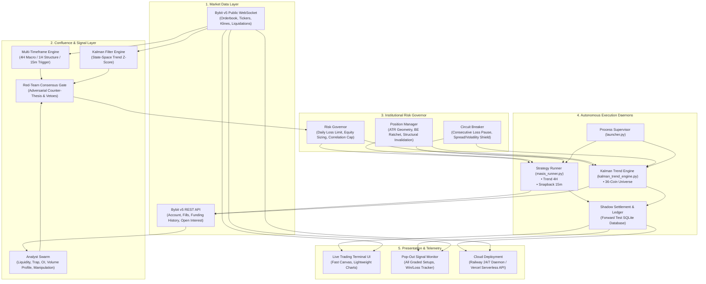

# ⚡ MASIS V3 / CME-X5 Model B — Bybit Trading Terminal & Quantitative Engine

<div align="center">

[](https://bybit-exchange.github.io/docs/v5/intro)
[](https://python.org)
[](https://nodejs.org)
[](LICENSE)
[](https://railway.app)
[](https://vercel.com)
[](#)

<p align="center">
  <b>Institutional-grade multi-timeframe quantitative terminal, autonomous execution daemons, and mathematical risk governor for Bybit linear perpetuals.</b>
</p>

<p align="center">
  <a href="#-quick-start">Quick Start</a> •
  <a href="#-system-architecture">Architecture</a> •
  <a href="#-autonomous-strategy-daemons">Strategy Daemons</a> •
  <a href="#-multi-agent-analyst-swarm">Analyst Swarm</a> •
  <a href="#-empirical-quant-research">Empirical Research</a> •
  <a href="#-deployment">Deployment</a> •
  <a href="#-disclaimer">Disclaimer</a>
</p>

</div>

---

### Highlights at a Glance

* **24/7 Autonomous Daemon Runner (`masis_runner.py` / `launcher.py`)**: Multi-strategy daemon executing across a 42-coin universe with zero browser dependency and automatic fault recovery.
* **Empirical Edge Over Hope**: 26 runnable quantitative studies measuring microstructural anomalies across multi-year data — including realistic taker fee (12–14 bps) and slippage deduction.
* **State-Space Kalman Trend Estimation**: Real-time adaptive filtering measuring momentum transitions without lagging moving-average distortions.
* **Multi-Agent Specialist Swarm**: 7 independent quantitative desks (Liquidity, Traps, Derivatives/OI, Market Structure, Volume Profile, Manipulation, Session) with adversary red-teaming and meta-learner reliability weighting.
* **Capital Protection Governor**: Hard equity-percentage position sizing (0.25% - 0.50%), exchange-side stops attached atomically, daily loss circuit breakers, and noise-floor validation.
* **Zero-Secret Architecture**: Secure `.env` credential management with strict production/demo separation (`MASIS_ALLOW_REAL_MONEY=0` safety latch).

---

## 🏛 System Architecture



---

## 🤖 Strategy Engines & Daemons

The terminal orchestrates two primary execution layers designed from empirical findings:

| Strategy | Engine Daemon | Primary Timeframe | Execution Mode | Stop Loss | Profit Target | Equity Risk |
|---|---|---|---|---|---|---|
| **Trend 4H** | `daemons/masis_runner.py` | 4H Candles | Orders on Bybit (Demo/Live) | `2.5 × ATR(4H)` (Exchange-side) | Dynamic trailing stop (`4 × ATR` behind peak close) | `0.25%` |
| **Snapback** | `daemons/masis_runner.py` | 15m Candles | Paper simulation (default) | `1.0 × ATR(1H)` (Exchange-side) | `1.0 × ATR(1H)` take-profit or 12h time-stop | `0.50%` |
| **Kalman Trend** | `daemons/kalman_trend_engine.py` | 4H / Daily Filter | Paper or Live orders | `3.0 × ATR(4H)` | Next open upon trend reversal (No fixed cap) | `0.50%` |

> [!IMPORTANT]
> **Safety First:** By default, all strategies operate against the Bybit Demo environment (`https://api-demo.bybit.com`) or simulated paper execution. Live mainnet order routing requires explicitly setting `MASIS_ALLOW_REAL_MONEY=1` and activating live switches in both `.env` and the UI dashboard.

---

## ⚡ Quick Start

### 1. Prerequisites
- **Python**: 3.10+
- **Node.js**: >= 18.0.0
- **Git**

### 2. Installation & Setup

```bash
# Clone the repository
git clone https://github.com/imashsachintha2015-hub/Bybit-dashbored.git
cd Bybit-dashbored

# Install Python backend dependencies
pip install -r requirements.txt

# Install Node dependencies
npm install

# Copy environment template
cp .env.example .env
```

### 3. Configure Credentials

Edit `.env` with your Bybit API credentials (Demo account keys recommended for initial verification):

```env
BYBIT_API_KEY=your_bybit_api_key
BYBIT_API_SECRET=your_bybit_api_secret
BYBIT_BASE_URL=https://api-demo.bybit.com
BYBIT_DEMO=1
MASIS_ALLOW_REAL_MONEY=0
```

### 4. Run the Full Stack

Launch the unified process supervisor (starts the local API server and restarts daemons automatically if interrupted):

```bash
python launcher.py
```

The terminal interface will be accessible at:
- **Main Terminal**: `http://localhost:8080`
- **Signal Monitor**: `http://localhost:8080/monitor.html`
- **Kalman Telemetry API**: `http://localhost:8080/api/kalman/status`

---

## 🚢 Cloud & Container Deployment

### Docker Deployment
```bash
# Build the container
docker build -t masis-terminal .

# Run the container with environment variables
docker run -d --name masis-runner -p 8080:8080 --env-file .env masis-terminal
```

### Deploy to Railway
The repository includes `railway.json` and `nixpacks.toml` configured for 24/7 daemon execution:
1. Push your repository to GitHub.
2. Link the repository in [Railway](https://railway.app).
3. Set your environment variables in the Railway dashboard.
4. Railway will automatically provision via Nixpacks/Python 3.10 and execute `python launcher.py`.

### Deploy to Vercel
The repository includes serverless functions in `api/` configured via `vercel.json`:
- Note: Run serverless functions in the `sin1` (Singapore) region to maintain low latency to Bybit endpoints without geographic routing blocks.

---

## 🔬 Empirical Quant Research & Architecture Analysis

## 1. What the measurement says

V2's decision and exit logic was reconstructed from the shipped source and run
over ~42 days of real 15-minute bars on BTC, ETH and SOL, with taker fees and
slippage charged on every fill. V3 was run over the identical bars with the
identical cost model and fill rules.

| | V2 (reconstruction) | V3 |
|---|---|---|
| trades | 1,051 | 38 |
| win rate | 39.6% | 39.5% |
| average win | 0.73R | 1.06R |
| average loss | 0.87R | 0.75R |
| **expectancy per trade** | **−0.335R** | **−0.015R** |
| profit factor | 0.46 | 0.97 |
| total R | −352 | −0.6 |
| return on $1,000 | −49% / −54% / −70% per symbol | −0.6% |

Read those two columns carefully, because they say two different kinds of thing.

**V2's failure is established, not suggested.** Over 1,051 trades the standard
error on expectancy is about 0.03R, so −0.335R sits roughly eleven standard
errors below zero. That is not variance. V2 was structurally losing money, and
it would have kept losing money for as long as it ran.

**V3's improvement is real; V3's profitability is not established.** The
expectancy gap of +0.32R per trade is large and traceable to specific fixed
defects. But V3's own expectancy of −0.015R comes from 38 trades, where the
standard error is around 0.15R. That interval comfortably contains both
modestly profitable and modestly unprofitable. The honest statement is: **the
bleeding is stopped and the known defects are fixed; a positive edge is not yet
demonstrated and needs several hundred more trades before anyone should believe
one exists.**

Anyone promising you a high win rate from a code change is guessing. What code
can do is remove the structural reasons a system loses. That is what this is.

### Costs are not a footnote

Running the same V3 logic on 5-minute structure instead of 15-minute produces a
negative expectancy at **every** parameter setting tried (−0.304R to −0.408R
across a six-cell sweep). The reason is arithmetic, not tuning. A round trip on
Bybit linear perps costs roughly 0.15% of notional once taker fees and slippage
are counted both ways. Against a stop 0.3% away, that is half of every 1R the
system earns. Against a stop 1.2% away, it is an eighth. Faster trading with
market orders does not have a parameter that fixes this.

That single finding is why V3 analyses 5m/15m/1h rather than the 1m series V2
used.

---

## 2. Why V2 lost money

### 2.1 The exit that cut every position the moment it turned red

This is the one you noticed, and it was the largest single defect.

`renderPositionGuardian()` ran on a 3-second timer and market-closed a position
whenever **any** of three conditions held: the live decision for that symbol had
flipped to the opposite side, the whale tracker's dominant side had flipped, or
the trap guard had tripped.

None of those are stable on a 3-second cadence. The decision was recomputed
every 3 seconds from 1-minute data and oscillated continuously; the whale side
flipped on a single $50k print inside a 5-minute window. So in practice: enter,
hit the ordinary retrace that follows almost every entry, get closed at market
for a small loss plus fees, repeat.

**In the reconstruction, 23.7% of all V2 exits were this cut** — 249 of 1,051
trades. And because the check never looked at P&L, it closed winners on exactly
the same trigger. A position at +2R could be flattened by a three-second blip in
whale side.

**Replaced by** `agents/position-manager.js`. A position now exits only on a
named structural event:

| Exit | Trigger |
|---|---|
| `STOP` | The broker-side stop attached at entry. The hard boundary. |
| `TARGET` | Planned scale-outs at TP1 / TP2 / TP3. |
| `STRUCTURE_BROKEN` | A **confirmed candle closes** beyond the invalidation level the setup was built on — not a tick through it. |
| `THESIS_FLIP` | A grade-A opposing setup persisting across 4 consecutive evaluations **and** the position is underwater. |
| `TIME_STOP` | The idea has had its bars and gone nowhere. Releasing dead risk is a good cut. |
| `EMERGENCY` | Data invalid, spread blowout, feed halt. |

Plus two rules that protect winners rather than culling them: a grace period
after entry during which only the hard stop applies, and a stop that ratchets to
break-even once TP1 is banked and then trails. Once the stop is at break-even
the remainder is a free option — its worst case is zero — so it is never retired
on a clock and never closed on an opinion.

### 2.2 A target structure that could not win

V2 set its stop at `max(1.2 × ATR, 0.3% of price)` and attached `takeProfit[0]`
broker-side **at full size**. That target sat at 1.1R.

So every winner was capped at 1.1R and every loser was a full 1.0R. The observed
figures were worse still: average win 0.73R against average loss 0.87R, which
needs a **54.4% win rate just to break even**. V2 achieved 39.6%.

The three-level take-profit ladder in the V2 source never ran, because the
full-size broker TP closed the whole position at TP1 before TP2 was reachable.

**Replaced by** stops placed beyond a structural invalidation level with an ATR
buffer, targets at 1R / 2R / 3.5R with TP2 pulled in when an opposing level sits
in front of it, a hard floor of 1.6 reward:risk to TP2, and a rejection of any
setup whose first target sits inside the fee-plus-spread band. Only the stop is
attached broker-side; the ladder is managed client-side so it can actually run.

### 2.3 Direction decided by counting correlated bullets

V2 called a BUY when at least three "bullish observations" existed and at most
one bearish one. The observations included `price > VWAP`, `EMA9 > EMA21` and
`delta > 0`.

Those are three restatements of "price went up recently". The count reached
three the moment price ticked up, in any tape, with no edge attached — and
nothing in the rule referenced *where* price sat relative to structure. Buying
strength at the top of a range and buying strength off a defended low are
opposite trades with opposite outcomes, and V2 could not tell them apart.

**Replaced by** four named playbooks in `agents/playbooks.js`, each requiring a
specific structural context and each carrying an invalidation level you can
point at on a chart: `TREND_PULLBACK`, `SWEEP_RECLAIM`, `RANGE_FADE`,
`BREAKOUT_RETEST`. Quality is scored from weighted, deliberately non-redundant
components and graded A+ through D. Only A and above are traded automatically.

### 2.4 A trust score that was a constant

V2's trust score was assembled from four hard-coded numbers
(`evidenceScore = 85`, `riskScore = 85`, `execScore = 90/70`, `histScore = 70`).
An authorised call always scored about 83. The `MIN_AUTO_TRADE_TRUST = 65`
filter downstream could therefore never reject anything — it was decoration.

**Replaced by** a score computed from the actual evidence, which is the same
number the backtest reports, so the grades are falsifiable.

### 2.5 Structure read from unconfirmed bars

Every indicator was computed including the forming candle, so the EMA stack and
market-state classification flickered within each bar.

Worse, the break-of-structure test compared live price against
`Math.max(...highs.slice(-20))` — a window that **includes the current bar's own
high**. Since a bar's high is always ≥ its last price, that test could
essentially only pass on the exact tick that printed a new high. The
`trend_expansion` classification that depended on it was crippled.

**Replaced by** structure derived from confirmed candles only, using fractal
swing pivots that require lower highs on both sides. Live price is used solely
for entry distance and risk geometry.

### 2.6 One timeframe

Everything was read from the 1-minute series, and the chart's interval buttons
silently changed it — so adjusting the chart changed the trading logic.

**Replaced by** a fixed 5m / 15m / 1h analysis set, subscribed independently of
whatever the chart displays. A higher-timeframe regime gate decides whether the
tape is tradable at all before the lower timeframe may propose anything. In the
backtest that gate stands the system down about 60% of the time, which is the
point.

### 2.7 A risk supervisor that was a UI card

`DIV-08 Risk Supervisor` rendered "Max Loss: 3.0% / Drawdown: 0.0%". There was
no code behind it. No daily loss limit, no consecutive-loss breaker, no cap on
concurrent positions, no cooldown after a stop-out.

And position size was a flat dollar margin per trade. A fixed $50 behind a
0.15%-away stop and behind a 1.2%-away stop are different risks by a factor of
eight, wearing the same label — which also means **no win rate computed across
V2's trades meant anything**, since the trades were not comparable units.

**Replaced by** `agents/risk-governor.js`, enforced before any order is sent:
size derived from risk so every trade risks the same fraction of equity, daily
loss limit, consecutive-loss circuit breaker, per-symbol cooldown after a trade,
concurrent-position cap, and a correlation cap (BTC/ETH/SOL open together is one
bet, not three).

### 2.8 Fabricated performance statistics

`trade_stats.json` shipped seeded with 14 wins, 6 losses, $3,482 of profit and
four invented trades, and `index.html` hard-coded the same figures into the
markup. The dashboard displayed a 70% win rate and a 3.1 profit factor before
the system had placed a single order.

Separately, `/api/performance` **added** Bybit's closed-PnL list to the locally
recorded stats — but the client also posted every close to `/api/trades/record`,
so every trade was counted twice, once from each source.

**Replaced by** zeroed counters, Bybit closed-PnL as the single source of truth
for money, local records supplying only setup and exit-reason metadata matched
by symbol/side/time, and R-multiple expectancy reported beside the win rate with
its sample size attached.

### 2.9 Live API keys in source

`server.py` carried working Bybit, DeepSeek, Benzinga and CoinGecko keys as
string literals.

**Rotate all four now.** They were in a file that was zipped and shared; treat
them as compromised. A Bybit key with trade permissions is enough to move money
the moment it is pointed at the live endpoint. Credentials now come from the
environment — see `.env.example` — and the server refuses to start without the
required ones rather than falling back to a default.

---

## 3. Why DeepSeek credit was burning

> **Current state: DeepSeek is switched off.** No code path sends anything to it unless `DEEPSEEK_ENABLED=1`,
> and a `DEEPSEEK_API_KEY` left in `.env` or in Railway's variables is ignored while it is off (the logic is the
> few lines in `backend_lib/deepseek_switch.py`). The news score falls back to keywords, the market read to the
> local quant read, the chart read to WAIT. `GET /api/llm/status` reports `"enabled": false` on a running server.
> `tests/test_deepseek_off.py` fails if any route sends a request to DeepSeek while it is off.

Three uncapped call sites, none gated on whether the answer could change a
decision:

1. **Every decision change, per symbol.** The decision was recomputed every 3
   seconds and oscillated `WAIT → BUY → WAIT → BUY`; each re-entry fired a fresh
   700-token synthesis, across five symbols in parallel.
2. **A blind 60-second refresh** of the focused symbol — about 1,440 calls a day
   that nobody asked for.
3. **The news sentinel re-scored all 15 headlines every 90 seconds**, re-sending
   headlines it had already scored — about 960 calls a day, nearly all duplicates.

That is on the order of 2,400 calls a day. And the output was prose: a
five-section "institutional executive brief" that no code parsed. **A 700-token
essay no code reads cannot change an outcome.** It was pure cost.

### What replaced it

The model is now consulted at the one point where its answer can change
something: a fully-formed candidate that has already passed every local gate. It
returns a compact structured verdict — `CONFIRM` / `DOWNGRADE` / `VETO` with a
one-sentence rationale, at 150 max_tokens — and the engine's gate consumes it.

`agents/deepseek-governor.js` refuses everything else locally:

- grade A or better only;
- a 10-minute per-symbol cooldown;
- a state fingerprint, so re-firing on the same setup is served from cache
  rather than paid for again;
- a hard daily ceiling (default 120), after which the system runs on local logic
  — which is the design, not a degradation.

Headline scoring is deduplicated: headlines are immutable once published, so
each is scored exactly once, and a feed where nothing changed costs zero calls.

`GET /api/llm/status` reports calls made, calls refused, cache hits and spend by
caller, so the burn is visible rather than inferred from a bill.

**Expected reduction: roughly 2,400 calls/day to under 120, with the token count
per call cut by about 80%** — and unlike before, the calls that remain are wired
to the decision.

---

## 4. Architecture

```
index.html
├── agents/indicators.js        pure math — EMA, Wilder ATR, VWAP, ADX,
│                               Kaufman efficiency ratio, fractal swings
├── agents/regime-agent.js      DIV-03  is this tape tradable, and which way
├── agents/flow-agent.js        DIV-02/04 CVD, absorption, flow bursts, spoof guard
├── agents/playbooks.js         DIV-05  the four named setups + scoring + geometry
├── agents/risk-governor.js     DIV-08  sizing, loss limits, breakers, cooldowns
├── agents/position-manager.js  DIV-12  structural exits, BE ratchet, trailing
├── agents/deepseek-governor.js DIV-07  model call gating and budget
├── masis-engine.js             orchestrator — per symbol, multi-timeframe
├── whale-agent.js              DIV-11  adaptive large-print detection
├── bybit-ws.js                 multi-timeframe subscriptions
└── app.js                      UI + execution wiring

server.py                       Bybit proxy, news, macro, supervisor, budget
backtest/                       walk-forward harness + V2 reconstruction
```

Every agent module loads both in the browser and in Node, so **the backtest
exercises the exact code the browser runs** rather than a reimplementation of it.

### Agents, and what each can actually do

An agent can only ever *remove* a trade. None of them can create one. A setup
exists because a playbook pattern is present, or it does not exist at all — the
context agents (news, macro, whale, spoof) act as vetoes on something that
already stands on its own. This is deliberate: V2's failure mode was
accumulating weak, correlated confirmations until a threshold was crossed.

---

## 5. Running it

```bash
cp .env.example .env          # fill in rotated keys
export $(grep -v '^#' .env | xargs)
python3 server.py             # http://localhost:8080
```

### Backtesting

```bash
node backtest/fetch-klines.js BTCUSDT,ETHUSDT,SOLUSDT 1,5,15 12000
node backtest/run-backtest.js --mode swing --equity 1000 --json results.json
node backtest/run-backtest.js --mode fast    # the fee-destroyed configuration
```

The harness commits to: no look-ahead (decisions at bar *i* use bars 0..*i*,
fills at bar *i+1*'s open); pessimistic intrabar ordering (if a 1-minute bar
contains both stop and target, the stop is taken); real costs on every fill
including partial scale-outs; and R reported **net** of every fee paid.

Two caveats stated plainly:

- **Data source.** Bybit's CDN geo-blocks the environment this was built in, so
  the cached data came from OKX USDT-margined perpetuals — same instrument type,
  highly correlated pricing. The fetcher tries Bybit first and records which
  venue it used; on your machine it will likely use Bybit directly.
- **No historical tape.** Klines carry no trade-by-trade data and no order book,
  so the backtest substitutes candle-derived proxies for taker flow and
  absorption (`backtest/flow-proxy.js`, which documents each proxy). Flow-weighted
  components are noisier there than live, and `RANGE_FADE` in particular is
  under-represented. Treat the backtest as a test of the **structure and risk**
  logic, which is where V2's losses actually came from — not as a forecast of
  live win rate.

### On the parameter values

Exit parameters were set from the **middle of the stable region** of a sensitivity
sweep, not its peak. Across `timeStopBars` of 12/18/30 the expectancy moved by
less than 0.1R, which on 38 trades is noise. Picking the best cell of that sweep
would be fitting to the sample and would not survive contact with new data.

---

## 6. What to do next

In priority order, with the reasoning:

1. **Rotate the four exposed API keys.** Before anything else.
2. **Paper-trade to 200+ trades before believing any win rate**, including the
   ones in this document. Expectancy in R is the number to watch, not win rate —
   a 39% win rate with 2R winners beats a 60% win rate with 0.5R winners.
3. **Try maker (limit) entries.** Round-trip cost is the single largest drag
   identified here. Bybit's maker fee is roughly a third of taker, and the
   `SWEEP_RECLAIM` and `BREAKOUT_RETEST` playbooks both have a natural resting
   price. This is likely worth more than any further signal work.
4. **Widen the sample before tuning anything.** Six weeks on three symbols is
   not enough to distinguish a real parameter effect from noise. Fetch a year
   and re-run before changing a threshold.
5. **Resist adding playbooks.** The failure mode being escaped is exactly the
   one that more, weaker signals recreate.

---

## 7. The analyst swarm (V3.1)

V3's "agents" were deterministic rule modules with grand names. This adds a real
panel of specialists that read the market the way a desk does, argue about it,
and can veto each other.

### The analysts

| Analyst | What it actually reads |
|---|---|
| **Liquidity Cartographer** | Where the stops are. Equal highs/lows, session and previous-day extremes, round numbers, swing clusters — each scored for how much resting liquidity is likely there, how untested it is, and how close. Price is drawn to resting liquidity because that is the only place size can be filled. |
| **Trap Forensics** | Completed trap sequences: inducement → raid → rejection → corroboration. Classifies SFP, failed breakout, liquidity grab and stop hunt. A poke through a level is not a trap; all four legs are required. |
| **Positioning & Derivatives** | Open interest, funding, crowd long/short ratio and measured taker volume. Classifies the OI/price quadrant (new longs / short covering / new shorts / long liquidation), detects squeeze fuel and coiled leverage. |
| **Market Structure** | BOS, CHoCH, order blocks, fair value gaps, premium/discount location. |
| **Volume Profile** | POC, value area, high- and low-volume nodes. Where business actually got done. |
| **Manipulation Forensics** | Spoofing, layering, iceberg signatures (live book), plus momentum ignition, wash-trade and liquidity-vacuum patterns from bars alone. |
| **Session & Time** | Asia/London/NY, killzones, thin-book hours, weekends. Scales confidence; never argues a direction. |

### How they argue

Analysts read the market independently — none sees another's conclusion, so
their agreement carries information. Then `swarm/debate.js` runs four stages:

1. **Weighted vote** — conviction × reliability weight from the meta-learner.
2. **Red team** — the provisional thesis is handed to an adversary that builds
   the counter-case from dissenting evidence and every veto naming this
   direction. A thesis that cannot outweigh its own best counter-argument is
   not traded.
3. **Fatal vetoes** — a small set of objections that cannot be outvoted:
   entering into a dense untapped liquidity shelf, joining crowded and
   well-paid positioning that price is refusing to reward, leaning on a level
   shown to be spoofed, or trading into a fresh trap.
4. **Concerns** — graded objections that shrink conviction without arguing the
   other side. A concern is a reason to trade smaller; an opposing read is a
   reason not to trade.

`swarm/meta-learner.js` tracks how often each analyst agreed with the
profitable direction, bucketed by regime, and reweights accordingly. Weights
are bounded to [0.4, 1.6] and do not move at all below 15 observations.

### What the measurement says — read this part

Trade-level statistics cannot settle whether an analyst is any good; a backtest
window produces a few dozen trades and a few dozen observations cannot separate
skill from luck. So `backtest/evaluate-analysts.js` scores every analyst against
forward returns on **every bar** — thousands of observations each.

Average forward move over 8 × 15m bars, in the direction the analyst pointed
(0.00 = no edge):

| Analyst | n | hit % | avg forward (ATR) | 1st half | 2nd half |
|---|---|---|---|---|---|
| Positioning & Derivatives | 1,692 | 49.0 | **+0.198** | no data | +0.198 |
| Trap Forensics | 1,159 | 54.7 | **+0.142** | +0.145 | +0.139 |
| *Debate output* | 7,592 | 52.6 | **+0.109** | +0.086 | +0.130 |
| Volume Profile | 3,397 | 57.2 | +0.095 | +0.169 | +0.019 |
| Liquidity Cartographer | 6,546 | 49.0 | +0.064 | +0.017 | +0.105 |
| Market Structure | 8,092 | 45.8 | **−0.040** | — | — |

Three things came out of this, and two of them changed the code:

- **Market Structure has no directional edge.** Break-of-structure pointed the
  right way 45.8% of the time — most breaks fail, which is a known property of
  the pattern. It no longer votes on direction and contributes levels, order
  blocks and location instead. It was *not* inverted to profit from the negative
  reading: fitting a sign to one dataset is how backtest artefacts are born.
- **Volume Profile and Trap Forensics were voting where their model is invalid.**
  Reversion to the POC is the wrong model in a trend (measured −0.241 ATR there),
  and a trap fade against an established trend is a counter-trend trade wearing
  a pattern's clothing (−0.096 ATR). Both now abstain in those conditions. That
  single change took the debate from +0.040 to +0.109 ATR and made it positive
  in *every* regime.
- **Derivatives is the strongest analyst by a wide margin**, and in a trending
  regime it is worth +0.491 ATR. Caveat: OKX retains only 30 days of open
  interest and funding, so this analyst has **no first-half data and no
  out-of-sample validation.** Treat it as promising, not proven.

### And now the part that matters most

**The analytical layer has measurable, split-sample-consistent directional edge.
None of the three integration modes converts it into better trade outcomes.**

Swing mode, same bars, same costs:

| Panel mode | trades | win % | expectancy |
|---|---|---|---|
| off | 66 | 42.4 | −0.089R |
| advisory (fatal vetoes only) | 18 | 50.0 | −0.153R |
| gating (thesis must agree) | 34 | 32.4 | −0.389R |

Full gating is clearly worse. Advisory is indistinguishable from off on 18
trades. The simplest configuration is still the best one measured.

The likely reason is arithmetic rather than mysterious: a **+0.109 ATR** edge is
real but small against a **~1 ATR** stop plus **~0.2R** of round-trip costs. The
panel is more often right about direction without being right by enough to pay
for the risk being taken. Requiring consensus may also select for *later*
entries — consensus forms after a move is underway — which is consistent with
the gating mode showing a lower win rate and larger average loss.

**Default is `advisory`.** The panel runs, its reasoning is displayed, and its
fatal vetoes stay active because they are sound risk rules on their own terms
rather than directional guesses. It is set to `advisory` and not `gating`
because gating measured worse, and shipping the more sophisticated-sounding
mode over the better-measured one is the same mistake V2 made with its agent
names. `swarmMode: 'off'` is one option away.

### A correction to Section 1

While building this I found a bug in my own harness: each timeframe was fetched
to the same **bar count**, so 12,000 one-minute bars covered 8 days while 12,000
fifteen-minute bars covered 126 days. The intrabar stop check used only the
1-minute series, so **stops went unchecked inside the bar for roughly 93% of
every swing-mode run** and losses could run past 1R before a bar closed. The
path now falls back through progressively coarser series and finally to the
decision bar's own high/low, which is the most pessimistic option available.

Section 1's V3 figures were produced before that fix. The corrected swing-mode
V3 baseline is **66 trades at −0.089R** rather than 38 at −0.015R. The V2
comparison is unaffected in its conclusion — V2 remains decisively negative at
−0.335R over 1,051 trades — but the gap between V2 and V3 is smaller than
Section 1 states.

### Running the analyst study

```bash
node backtest/fetch-derivatives.js BTC,ETH,SOL     # OI, funding, positioning, real taker volume
node backtest/evaluate-analysts.js --horizon 8 --step 3
node backtest/run-backtest.js --mode swing --ab 1 --swarmMode advisory
```

---

## 8. Research: where the edge actually is (V3.2)

Four runnable studies in `research/`, measured on the same data as the trading
system. Full write-up in [`research/README.md`](research/README.md).

The headline, because it changes what to do next more than anything else in this
repository: **the same signals, on the same bars, with the same risk sizing,
cross from losing to profitable on execution style alone.**

| execution | trades | win % | expectancy |
|---|---|---|---|
| taker (market in and out) | 244 | 41.4 | **−0.137R** |
| maker, limit at the touch | 244 | 48.0 | **−0.057R** |
| maker, limit 10 bps better | 222 | 43.7 | **+0.000R** |

The **relative** gain — +0.137R per trade from execution alone, over 244 trades —
is larger than every signal improvement made across this entire project, the
analyst swarm included, and it is arithmetic rather than fitted. It is available
via `--exec maker` and is the change to make before any further work on
prediction.

The absolute level is break-even, not profitable. An earlier version of this
table, measured on 126 days and 66 trades, reported +0.169R and described the
strategy as crossing into profit. That was small-sample optimism; on 3.3x the
data it lands at zero. See `research/README.md` for the correction in full.

The other three findings, briefly:

- **Direction is near-unpredictable; volatility is not.** Return autocorrelation
  is ~0.01 at every lag. Absolute-return autocorrelation is 0.30 and decays
  slowly, and recent volatility explains ~20% of future volatility. Forecast
  the quantity that is forecastable.
- **"Do it 100,000 times" multiplies the per-trade number, it cannot change its
  sign.** At the best measured edge (0.264 bps) against an 11 bps retail taker
  round trip, 100,000 repetitions costs 107% of the stake.
- **Funding harvest is real and small.** Delta-neutral, ~4.2%/yr net on BTC and
  ETH over the window measured. The selective "only when funding is positive"
  variant loses to simply staying on, because re-entry fees exceed what the
  timing saves.

---

## 9. Kalman Trend mode (V3.3)

The one setup that survived every honest test in `research_archive/` is now a dashboard mode next to Championship and CME-X5 Pure.

**What it does.**
- **Long:** the 4H Kalman trend turns up (z crosses +1) while BTC's daily trend is up. It is skipped when the last 3 days of funding average more than 0.03% per 8h.
- **Short:** the trend turns down (z crosses −1) while BTC's daily trend is down and that funding average is positive.
- **Exit:** a 3-ATR stop; out at the next open after the trend flips back, or after 20 days. No take-profit: the profit comes from the few trades that run far.
- **Sizing:** 0.5% risk per trade, at most 8 open, one per coin, on 36 coins.
- **Backtest:** $10 → $94.12 from 2020 to 2026 (1,616 trades, max drawdown −28%); $10 → $19.37 from 2024 to 2026 (765 trades).
  - Positive up to about 0.95% slippage per fill.
  - Expect about 20 trades a month, 35% winners and long losing streaks.
  - Studies: `research_archive/longshort/`, `openinterest/` and `situations/`.

**How it runs.**
- `daemons/kalman_trend_engine.py` is started by `launcher.py` (`MASIS_KALMAN=0` keeps it off) and wakes at every 4H close (00, 04, 08, 12, 16, 20 UTC).
- It reads Bybit public 4H bars and funding, computes the signals with `backend_lib/kalman_trend.py`, and keeps a forward-test record of every system signal in `$DATA_DIR/kalman_trend.db`.
- It writes `scratch/kalman_trend_live.json` and `scratch/kalman/<SYMBOL>.json` for the dashboard.
- **Mode not selected:** it only records signals.
- **Mode selected:** it trades:
  - **PAPER (default):** a virtual account, default $10, with the research accounting (next-open fills, stop first, 14 bps fees plus real funding).
  - **LIVE:** market orders with an exchange-side stop on the Bybit account of `BYBIT_BASE_URL`. This needs `KALMAN_LIVE=1` on the server **and** the dashboard switch (Kalman panel → Settings → LIVE orders). Like the strategy runner, it refuses a real-money endpoint unless `MASIS_ALLOW_REAL_MONEY=1`.
  - When the exchange minimum would force a position bigger than the 0.5% risk, the trade is skipped unless the larger risk stays within "max risk if the exchange minimum is bigger" (default 2%).
- Open positions are always managed to their exit, even after another mode is selected. The legacy CME-X5 / Championship engine (off unless `MASIS_LEGACY_ENGINE=1`) stands down while Kalman is selected.
- **Sharing the account with the strategy runner and the SBGZ auto-orders.** All of them can trade the same Bybit account:
  - Kalman never enters a coin that already has a position or a resting order; the runner does the same.
  - It manages and books only the position it opened itself: the same side, size and entry price on the exchange. If the coin's position is not its own any more (another strategy's, or changed by hand), Kalman leaves it alone and says so in its events.
  - Its result comes only from closed-P&L records at its own entry price, so another strategy's trade on the same coin is never counted.
  - Every order carries a deterministic id, so a retry cannot open the same trade twice. A position whose stop cannot be set is closed.
  - Open risk adds up across the strategies: the runner's caps (up to 7.5% of equity) count only its own trades, and Kalman's 8 positions at 0.5% add up to 4%.

**Dashboard.**
- **Mode button:** opens a three-way chooser.
- **Kalman panel** (sidebar or quick-jump "Kalman Trend", mobile tab "Kalman") shows:
  - mode, execution, equity, positions, results, BTC daily trend and the forward test;
  - open positions with R;
  - a radar of every coin (z, trend, funding, this bar's signal and why it was or wasn't taken);
  - closed trades, a signal log (every signal and what the engine did with it), engine events and settings;
  - a **Day filter** (All days, Today, Yesterday, previous/next day, date picker; the browser's time zone) for positions, trades, signals and events, with a summary of the day's trades, wins, R and P&L;
  - a click on any coin row opens that coin's chart with the Kalman line;
  - it scrolls and fits on phones (the header with the mode and Settings buttons is shown, and the tables do not trap swipes).
- **KALMAN chart indicator** (on the Bybit Fast Canvas chart, 4H and lower):
  - the Kalman trend line, green or red with the trend;
  - entry and exit markers with R;
  - the entry and stop lines of an open position;
  - a z readout.

**API.**
- `GET /api/kalman/status`
- `GET /api/kalman/indicator?symbol=BTCUSDT`
- `GET /api/kalman/history`: every closed trade, signal and engine event (what the day filter reads; kept in `$DATA_DIR/kalman_trend.db`)
- `POST /api/kalman/settings`: risk %, max open, optional open-interest and correlation rules, leverage, live switch, paper restart. Values are validated and clamped.

**Checks.**
- `tests/test_kalman_trend.py` covers the rules, sizing and settings, plus paper, standby and live runs against a fake exchange, including an account shared with other strategies.
- `research_archive/live_module/`:
  - the live code reproduces all 3,080 research trades;
  - a 15-month bar-by-bar replay of the engine takes the same 363 portfolio trades as the backtest;
  - a browser check of the mode, panel and indicator.


---

## 📁 Repository Layout

```
.
├── launcher.py               # Master process supervisor & daemon restarter
├── server.py                 # FastAPI/HTTP backend proxy, historical klines, web server
├── index.html                # High-performance live trading terminal UI
├── monitor.html              # Pop-out signal monitor & resolution ledger
├── app.js                    # Terminal client logic & execution wiring
├── chart.js                  # Fast Canvas & TradingView lightweight-chart rendering
├── daemons/
│   ├── masis_runner.py       # Autonomous 24/7 strategy runner (Trend 4H & Snapback)
│   ├── kalman_trend_engine.py# State-space Kalman filter engine (36 coins)
│   └── cme_x5_pure_engine.py # CME-X5 execution daemon
├── backend_lib/
│   ├── kalman_trend.py       # Kalman state filter & mathematical estimation
│   ├── deepseek_switch.py    # Zero-cost local fallback switch
│   └── live_bybit_adapter.py # Resilient Bybit v5 API order routing
├── agents/                   # Structural rule modules & risk governors
│   ├── indicators.js         # Math core: Wilders ATR, Kaufman efficiency, fractal swings
│   ├── risk-governor.js      # Strict equity risk sizing & daily loss limit
│   └── position-manager.js   # Structural exits, break-even ratchet, trailing stop
├── analysts/                 # Specialist desks (liquidity, traps, derivatives, etc.)
├── swarm/                    # Consensus engine, adversarial red team, meta-learner
├── research/                 # 26 empirical studies & backtesting experiments
├── tests/                    # Unit & regression test suite
├── Dockerfile                # Production container specification
├── railway.json              # Railway 24/7 deployment specification
└── vercel.json               # Vercel serverless configuration
```

---

## ⚙️ Environment Configuration

| Variable | Description | Default | Safety Note |
|---|---|---|---|
| `BYBIT_API_KEY` | Bybit V5 API Key | - | Required |
| `BYBIT_API_SECRET` | Bybit V5 API Secret | - | Required |
| `BYBIT_BASE_URL` | Bybit REST Endpoint | `https://api-demo.bybit.com` | Use demo for testing |
| `BYBIT_DEMO` | Flag for Demo mode | `1` | Set `0` only for live |
| `MASIS_ALLOW_REAL_MONEY` | Safety switch for live funds | `0` | Refuses live orders unless `1` |
| `MASIS_RUNNER` | Start strategy runner in launcher | `1` | `0` keeps runner off |
| `MASIS_KALMAN` | Start Kalman daemon in launcher | `1` | `0` keeps Kalman off |
| `KALMAN_LIVE` | Route Kalman orders to exchange | `0` | Default paper execution |
| `DEEPSEEK_ENABLED` | Enable DeepSeek LLM features | `0` | Defaults to zero-cost local logic |
| `PORT` | Web server port | `8080` | Configurable |

---

## ⚠️ Financial & Risk Disclaimer

> [!CAUTION]
> **HIGH RISK NOTICE:** Cryptocurrency perpetual futures trading carries substantial risk of loss and is not suitable for all investors. High leverage can work against you as well as for you.
>
> 1. This software is for educational, empirical research, and quantitative analysis purposes.
> 2. Past performance, backtests, and empirical studies do not guarantee future returns.
> 3. Always test strategies thoroughly on a demo account or simulated paper environment before committing capital.
> 4. You are solely responsible for managing your financial risk, API credentials, and trade sizing.

---

## 📄 License

This project is licensed under the [MIT License](LICENSE) - see the LICENSE file for details.
