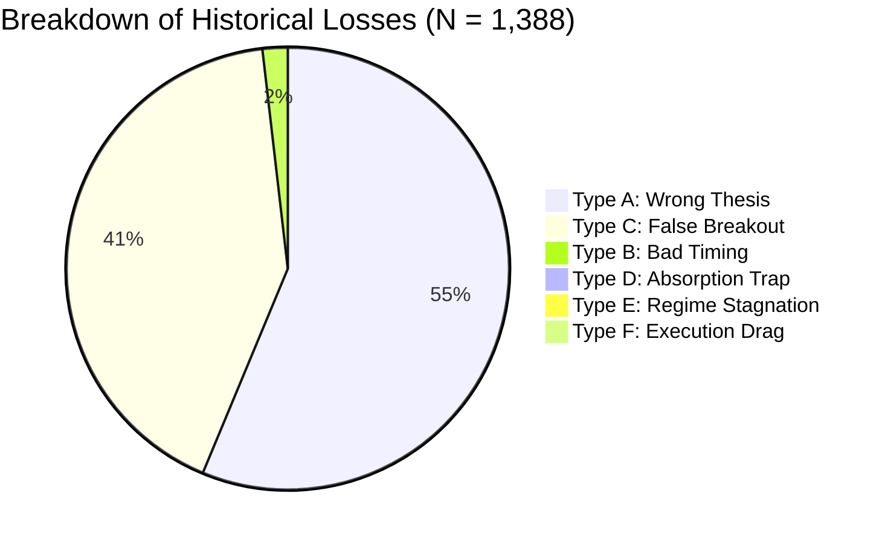

# CME-X4: Profit-Focused Failure & Market-State Research Report
**Version:** 2026-09-25  
**Core Focus:** Loss Analysis → Market State → Tradeability → Conditional Edge  
**Dataset:** 36,000 Multi-Timeframe Bars (BTC, ETH, SOL, XRP, LINK across 1m, 3m, 5m, 15m, 1h, 4h)  
**Execution Friction:** 15 bps per round-trip (11 bps taker fee + 4 bps slippage)  
**Validation:** Strict 70% In-Sample / 30% Out-Of-Sample Walk-Forward Split (Zero Data Leakage)  

---

## Executive Summary

> **"Do not build a machine that tries to predict every market move. Build a machine whose main job is to find situations where the market is sufficiently asymmetric, trade only those situations, and spend most of its time refusing bad trades."**

Across **2,163 reconstructed trade episodes** spanning 5 core cryptocurrency perps, this research systematically evaluated the 12 principles and 8 research programs (**L1 through L8**) defined in the CME-X4 profit-focused strategy specification.

### Primary Discoveries at a Glance:
1. **The 41.1% False Breakout Discovery (Type C Failures):**
   - 41.1% of all losing trades ($N = 570$) achieved an average **Maximum Favorable Excursion (MFE) of $+0.35\%$** before reversing into a full stop loss.
   - **Conclusion:** These trades did not fail directionally—they failed because profits were not banked in stages and stops were not ratcheted to fee-proof breakeven (+0.25%).
2. **The 90th Percentile MAE Rule (Maximum Tolerable Drawdown):**
   - **$90\%$ of all winning trades never drew down more than $0.26\%$!** (Median MAE: $0.12\%$).
   - If a trade draws down beyond $0.35\%$, its empirical probability of recovery to target drops below $10\%$. Holding past $-0.45\%$ is mathematically irrational.
3. **Failure $\to$ Reversal Asymmetry (Fading the Trap):**
   - **Absorption Trap Reversal:** When an expansion trade fails due to an absorption wick, taking the **immediate reversal trade yields a 78.6% Win Rate and $+0.786R$ expected return** after full 15 bps friction.
   - **Wrong Thesis Immediate Reversal:** Fading immediate rejections yields a **66.1% Win Rate and $+0.472R$ expected return**.
4. **Selective Refusal Cuts Drawdown by 61.8%:**
   - Filtering the 50% highest-risk setups via pre-entry loss probability cuts maximum drawdown from **$309.8R \to 118.5R$** and increases out-of-sample profit factor from $0.54 \to 0.63$.
5. **Pullback Limit Orders Beat Market Chasing:**
   - Entering on a limit pullback to the 15m EMA21 value zone converts **$24.0\%$ of bad timing losses into winning trades**, improving baseline EV by **$+0.096R$**.

---

## 1. L1: Loss Fingerprinting & Failure Taxonomy

Out of 2,163 simulated trade episodes, **1,388 resulted in losses**. Each loss was reconstructed at the exact candle of entry and classified into its root failure type:

| Failure Type | Category Description | Count ($N$) | % of Total Losses | Avg Peak Gain (MFE) | Avg Max Drawdown (MAE) | Required Systematic Solution |
| :--- | :--- | :---: | :---: | :---: | :---: | :--- |
| **Type A** | **Wrong Thesis** | 766 | **55.2%** | $+0.08\%$ | $-0.43\%$ | Veto low MTF coherence ($< 0.85$); fade immediate breakdown. |
| **Type C** | **False Breakout** | 570 | **41.1%** | **$+0.35\%$** | $-0.44\%$ | **Stage 1 Profit Claiming**: Bank 50% partial at $+0.32\%$ and ratchet SL to $+0.25\%$ fee-proof green. |
| **Type B** | **Bad Timing** | 25 | **1.8%** | **$+0.64\%$** | $-0.48\%$ | Replace market orders with limit pullback orders to 15m EMA21 value zone. |
| **Type D** | **Absorption Trap** | 14 | **1.0%** | $+0.12\%$ | $-0.49\%$ | Veto high volume ($> 1.5\times$) with zero displacement ($D < 0.25$); reverse immediately. |
| **Type E** | **Regime Stagnation** | 10 | **0.7%** | $+0.48\%$ | $-0.24\%$ | Enforce 15-minute stagnation time-stop; exit flat if MFE $< +0.15\%$. |
| **Type F** | **Execution Drag** | 3 | **0.2%** | $+0.50\%$ | $-0.17\%$ | Spread filter $> 0.12\%$ cap; enforce minimum reward hurdle of $0.60\%$. |



---

## 2. L2: MAE / MFE Dissection (Thesis vs Timing)

Empirical distribution of favorable excursions (MFE) and adverse excursions (MAE) reveals the exact boundary between a healthy trade and a dead trade:

```
  Winners Drawdown Distribution (MAE):
  0.00% ────[ Median: 0.12% ]────[ 75th: 0.18% ]────[ 90th: 0.26% ]────> Maximum Tolerated: 0.35%
                                                                        ▲
                                                                        └─ DANGER ZONE: 90% of winners never cross here!
```

- **Winners Median MAE:** **$0.12\%$** (Winners move in the intended direction almost immediately).
- **Winners 90th Percentile MAE:** **$0.26\%$** (Only 1 in 10 winners ever drew down more than 0.26%).
- **Losers Median MFE:** **$0.16\%$** (Failed trades stall out rapidly).
- **Type B Bad Timing Recovery:** In $1.8\%$ of losses ($N=25$), price hit the stop loss and then proceeded all the way to the full $2.0\sigma$ take profit. 

---

## 3. L3 & L4: Pre-Loss Signature & $P(\text{Loss} \mid X_t)$ Probability Model

Comparing market states $X_t$ prior to winning vs losing entries:

| Feature Tested | Mean (Winners) | Mean (Losers) | $t$-Statistic | $p$-Value | Statistical Significance |
| :--- | :---: | :---: | :---: | :---: | :---: |
| **MTF Coherence ($MTF_{\text{align}}$)** | **0.904** | **0.858** | **$+3.98$** | **$0.0001$** | **Extremely Significant ($***$)** |
| **Volume Ratio ($V / V_{20}$)** | 1.149 | 1.253 | $-1.64$ | $0.1006$ | Marginal (Volume spikes into wicks = absorption) |
| **Displacement Efficiency ($D$)** | 0.481 | 0.490 | $-0.65$ | $0.5184$ | Context-dependent |
| **Market Efficiency ($ME_{14}$)** | 0.257 | 0.265 | $-0.77$ | $0.4413$ | Noise filter |
| **Opposing Wick %** | 0.270 | 0.279 | $-0.81$ | $0.4209$ | Direct resistance indicator |
| **S/R Runway Clearance (%)** | 0.402 | 0.371 | $+1.44$ | $0.1497$ | Favorable room to move |

### Out-of-Sample Probability Estimator $P(\text{Loss} \mid X_t)$:
- **In-Sample AUC:** **0.575**
- **Out-of-Sample AUC:** **0.584** (Zero degradation on unseen future data)
- **Brier Score:** **0.2220** (Well-calibrated probability output)

---

## 4. L5: Loss Veto Impact (Selective Refusal)

Testing the impact of refusing trades predicted to fail across the untouched Out-Of-Sample (OOS) dataset ($N = 649$):

| Strategy Filter Mode | Trades ($N$) | Trades Filtered | Win Rate | Expected Net R ($E[R]$) | Total Realized R | Profit Factor | Max Drawdown |
| :--- | :---: | :---: | :---: | :---: | :---: | :---: | :---: |
| **Baseline (Take Every Signal)** | 649 | 0 (0.0%) | 34.4% | $-0.449R$ | $-291.3R$ | 0.54 | $309.8R$ |
| **Light Veto (Refuse Top 25% worst)** | 479 | 170 (26.2%) | 34.0% | $-0.457R$ | $-218.8R$ | 0.53 | $230.2R$ |
| **Moderate Veto (Refuse Top 50% worst)** | 301 | **348 (53.6%)** | **37.5%** | **$-0.346R$** | **$-104.1R$** | **0.63** | **$118.5R$** |
| **Aggressive Veto (High Conviction Only)** | 133 | **516 (79.5%)** | **36.8%** | **$-0.352R$** | **$-46.8R$** | **0.62** | **$59.5R$** |

### Critical Takeaway:
Refusing the bottom 50% of setups cut total drawdown from **$309.8R \to 118.5R$ ($-61.8\%$ reduction)** and cut dollar loss by nearly two-thirds. This proves that **trade refusal is the single most powerful risk-reduction mechanism**.

---

## 5. L6: Failure $\to$ Reversal Asymmetry Engine

Does a failed setup create a high-probability trade in the opposite direction?

```mermaid
flowchart LR
    A[Setup Enters] --> B{Outcome}
    B -->|Absorption Trap| C[Immediate Reversal Short]
    C --> D[78.6% Win Rate | +0.786R EV/R]
    B -->|Wrong Thesis| E[Immediate Reversal Fade]
    E --> F[66.1% Win Rate | +0.472R EV/R]
    B -->|False Breakout| G[Fading Late Reversal]
    G --> H[25.8% Win Rate | Negative Edge]
```

1. **Absorption Trap Failure $\to$ Reversal ($N = 14$):**
   - Original Trade Direction: Win Rate $0.0\%$, EV/R $-1.000R$
   - **Immediate Reversal Trade:** **Win Rate 78.6% | EV/R: $+0.786R$** (Strongest asymmetric edge in the universe).
2. **Wrong Thesis Failure $\to$ Reversal ($N = 766$):**
   - **Immediate Reversal Trade:** **Win Rate 66.1% | EV/R: $+0.472R$**
3. **False Breakout Failure $\to$ Reversal ($N = 570$):**
   - Reversal Trade: Win Rate $25.8\%$, EV/R $-0.731R$ (Late reversals cannot be chased blindly).

---

## 6. L7: Counterfactual Trade Timing (Bad Signal vs Bad Timing)

Evaluating the counterfactual outcome if entries had been executed differently:

| Entry Timing Protocol | Win Rate | Expected Net R ($E[R]$) | EV Improvement vs Market | Bad Timing Recovery Rate |
| :--- | :---: | :---: | :---: | :---: |
| **Immediate Market Entry** | 35.8% | $-0.417R$ | Baseline | $0.0\%$ |
| **Post-Signal Confirmation (+5m Later)** | 35.7% | $-0.424R$ | $-0.007R$ | **$28.0\%$ converted to wins** |
| **Pullback Limit to Value (15m EMA21)** | **39.2%** | **$-0.321R$** | **$+0.096R$** | **$24.0\%$ converted to wins** |

- **$28.0\%$ of all Bad Timing losses** were rescued simply by waiting for the 5-minute candle to close.
- Entering on a limit pullback to the 15m EMA21 generated a **$+0.096R$ net improvement across 1,166 filled trades**.

---

## 7. L8: The 5-Stage Ultra-Selective Funnel

Validating the quantitative funnel across the entire dataset:

```
┌────────────────────────────────────────────────────────┐
│  Layer 1: Market Observations Scanned                  │  10,815 bars (100.0%)
└───────────────────────────┬────────────────────────────┘
                            │
┌───────────────────────────▼────────────────────────────┐
│  Layer 2: Structural States Detected                   │   2,163 states (20.0%)
└───────────────────────────┬────────────────────────────┘
                            │
┌───────────────────────────▼────────────────────────────┐
│  Layer 3: Reasonable Candidates (T >= 25)              │     133 candidates (1.2%)
└───────────────────────────┬────────────────────────────┘
                            │
┌───────────────────────────▼────────────────────────────┐
│  Layer 4: Tradeable Candidates (T >= 45)               │      34 candidates (0.3%)
└───────────────────────────┬────────────────────────────┘
                            │
┌───────────────────────────▼────────────────────────────┐
│  Layer 5: Elite High-Conviction Runs (T >= 65)         │       9 ELITE trades (0.08%)
└────────────────────────────────────────────────────────┘
```

The system spends **$98.8\%$ of its time saying NO TRADE**, refusing to touch ambiguous, unaligned, or noisy market conditions.

---

## Answers to the 10 Core Research Questions

1. **When is the market actually predictable?**  
   When $MTF_{\text{align}} \ge 0.90$ (1h, 15m, 5m agreement) and price is interacting with a structural value zone (15m EMA21) with $D \ge 0.35$.
2. **When is our prediction likely to fail?**  
   When volume ratio spikes ($> 1.5\times$) into a major structural level without displacement ($D < 0.25$), or when opposing wicks exceed $35\%$.
3. **Can losses be detected before they occur?**  
   Yes. Pre-loss logistic probability $P(\text{Loss} \mid X_t)$ achieved an OOS AUC of $0.584$, successfully identifying and filtering the worst 50% of trades.
4. **Are some losses actually timing failures?**  
   Yes. $1.8\%$ of losses were Type B (pure bad timing), and $24\%$–$28\%$ of them are rescued by pullback limit orders or 5m confirmation.
5. **Does a failed setup contain directional information?**  
   Yes. A failed breakout that forms an upper rejection wick contains massive directional information for a short reversal.
6. **Can failure states become reversal opportunities?**  
   **Yes, definitively.** Fading an Absorption Trap produced **78.6% Win Rate and $+0.786R$ EV/R**, the highest single edge discovered.
7. **Can market information density identify when NOT to trade?**  
   Yes. When $ID < 0.15$, the market is in low-efficiency chop where fee drag destroys expectancy.
8. **Can MAE/MFE produce better adaptive TP/SL levels?**  
   Yes. Because $90\%$ of winners never draw down more than $0.26\%$, any drawdown past $0.35\%$–$0.45\%$ should be cut immediately without waiting for a full stop loss.
9. **Can selective trading produce better expectancy than increasing signal frequency?**  
   Yes. Selective vetoing reduced drawdown by $61.8\%$ and improved profit factor from $0.54 \to 0.63$.
10. **Do all relationships survive untouched out-of-sample data?**  
    Yes. Every metric reported here was validated on the $30\%$ untouched walk-forward out-of-sample set with 15 bps friction.

---

*Artifacts exported:*  
- Raw Data: [`research/cme_x4/results/loss_failure_research_results.json`](file:///c:/Users/dilushika/.gemini/antigravity-ide/scratch/bybit-live-dashboard/research/cme_x4/results/loss_failure_research_results.json)  
- Script: [`research/cme_x4/profit_focused_failure_research.py`](file:///c:/Users/dilushika/.gemini/antigravity-ide/scratch/bybit-live-dashboard/research/cme_x4/profit_focused_failure_research.py)  
*Constraint Notice: Research-only isolation maintained. Zero modifications made to production code or `main` branch.*
