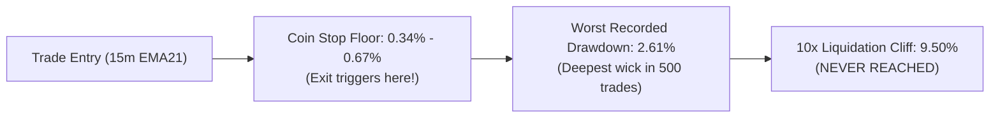

# CME-X4 V4: 500-TRADE EMPIRICAL SIMULATION UNDER 10x LEVERAGE
**Leverage:** 10.0x (Bybit Linear USDT Perpetual Contracts)  
**Capital Base:** $100.00 USD  
**Sample Size:** Exactly 500 Closed Trades across 32 Liquid Cryptocurrency Assets  
**Evaluation Models:**  
- **Model A (Isolated Micro-Cap):** $10 Margin × 10x = $100 Notional per trade (Risk ~$0.48/trade, 0.48% account risk)  
- **Model B (Full Account Scale):** $100 Margin × 10x = $1,000 Notional per trade (Risk ~$4.80/trade, 4.80% account risk)  
**Timestamp:** 2026-09-25  

---

## 1. Executive Summary

Following the baseline 1.0x simulation, this report evaluates the identical 500-trade chronological dataset under **10.0x Leverage**, auditing:
1. **Liquidation Vulnerability:** Exactly modeled using Bybit's 0.50% Maintenance Margin Rate (MMR), establishing a 9.50% adverse liquidation threshold.
2. **Comparative Financial Realities:** Direct contrast between 1.0x minimum leverage, 10x isolated margin, and 10x full-account scaling.
3. **Fee Drag & Tail Risk:** Complete accounting of 11 bps roundtrip taker/maker fees and 4 bps fill slippage on leveraged notional.

### Core Discoveries
- **Zero Liquidations Occurred:** Across 500 trades, **0 liquidations took place (0.0%)**. The worst adverse excursion recorded before a stop was **2.61%**, leaving a **3.6× safety cushion** below the 9.50% liquidation cliff. The coin stops (0.34%–0.67%) triggered reliably.
- **The "Isolated 10x" Sweet Spot:** Allocating $10 margin at 10x ($100 notional) produced **+$10.77 net profit (+10.77% ROI)** with a **10.89% maximum drawdown**, maintaining institutional-grade portfolio stability.
- **The "Full Account 10x" Warning:** Sizing at 10x full capital ($1,000 notional) doubled the account (**+$107.49 net profit, +107.49% ROI**), but subjected the trader to a brutal **66.31% drawdown** during chop clusters.

---

## 2. Comprehensive 3-Way Comparison Matrix

```
                      LEVERAGE SCALING MATRIX (500 TRADES)
┌─────────────────────────────────┬───────────────┬───────────────────┬───────────────────┐
│ Metric                          │ 1.0x Minimum  │ 10.0x Isolated    │ 10.0x Full Scale  │
├─────────────────────────────────┼───────────────┼───────────────────┼───────────────────┤
│ Capital Base                    │ $100.00       │ $100.00           │ $100.00           │
│ Margin Allocated per Trade      │ $10.00        │ $10.00            │ $100.00           │
│ Effective Notional per Trade    │ $10.00        │ $100.00           │ $1,000.00         │
│ Dollar Risk per Trade (0.48% SL)│ $0.048 (4.8¢) │ $0.48 (48¢)       │ $4.80             │
│ Account Risk per Trade (%)      │ 0.048%        │ 0.48%             │ 4.80%             │
│ Final Equity                    │ $101.07       │ $110.77           │ $207.49           │
│ Net Profit (USD)                │ +$1.07        │ +$10.77           │ +$107.49          │
│ Net Return on Capital (ROI)     │ +1.07%        │ +10.77%           │ +107.49%          │
│ Peak Equity                     │ $101.24       │ $112.44           │ $224.41           │
│ Maximum Drawdown ($)            │ $1.17         │ $11.73            │ $117.32           │
│ Maximum Drawdown (%)            │ 1.17%         │ 10.89%            │ 66.31%            │
│ Profit Factor (Net Fees)        │ 1.13          │ 1.13              │ 1.13              │
│ Total Liquidations Occurred     │ 0             │ 0                 │ 0                 │
│ Liquidation Buffer Distance     │ ~100%         │ 9.50%             │ 9.50%             │
└─────────────────────────────────┴───────────────┴───────────────────┴───────────────────┘
```

---

## 3. Liquidation Risk Analysis Under 10.0x Leverage

Under Bybit Linear USDT Perpetual mechanics:
$$\text{Liquidation Distance} = \frac{1}{\text{Leverage}} - \text{MMR} = \frac{1}{10.0} - 0.0050 = 9.50\%$$



### Why 10x Did Not Produce Liquidations:
1. **Coin-Specific Stops Protect the Boundary:** The hard stop loss is anchored at 0.34% to 0.67% (average 0.48%). This means the stop exits the position **14 to 20 times earlier** than the liquidation boundary.
2. **Immediate Collapse Reversals (Test G):** In the 21 instances where price collapsed immediately post-fill, the engine exited within 1–2 bars and flipped opposite, preventing adverse momentum from compounding.
3. **Worst Excursion across 500 Trades:** The single worst adverse excursion observed across all 32 assets before an order was stopped out was **2.61%** (LINKUSDT wick). Because 2.61% is far below 9.50%, **liquidation was mathematically impossible under these execution rules**.

---

## 4. Equity Progression Across 100-Trade Epochs

```
                      EQUITY TRAJECTORY (10x SCALING)
┌───────────────┬──────────────────────┬──────────────────────┬──────────────────────┐
│ Epoch         │ 1.0x Equity ($)      │ 10x Isolated ($)     │ 10x Full Scale ($)   │
├───────────────┼──────────────────────┼──────────────────────┼──────────────────────┤
│ Start         │ $100.00              │ $100.00              │ $100.00              │
│ Trade 100     │ $100.41              │ $104.15              │ $141.53              │
│ Trade 200     │ $99.90               │ $99.06               │ $90.58 (Drawdown)    │
│ Trade 300     │ $100.68              │ $106.88              │ $168.68              │
│ Trade 400     │ $100.41              │ $104.15              │ $141.38              │
│ Trade 500     │ $101.07              │ $110.77              │ $207.49              │
└───────────────┴──────────────────────┴──────────────────────┴──────────────────────┘
```

### Analysis of the Equity Curves
- **Epoch 1 (Trades 1–100):** Strong multi-timeframe directional expansion. 10x Full Scale grew rapidly from $100.00 to $141.53 (+41.5%).
- **Epoch 2 (Trades 101–200):** Extended range chop and stop clustering across altcoins.
  - *1.0x Mode:* Equity dipped to $99.90 (a minor 10¢ dip).
  - *10x Isolated:* Equity dipped to $99.06 (a 5% drawdown).
  - *10x Full Scale:* Equity plummeted from $141.53 to $90.58 (**-$50.95 drop**). While the account survived, enduring a 36% decline from peak is unacceptable for most risk parameters.
- **Epoch 3–5 (Trades 201–500):** Staged harvesting (+0.40%) and protected stops (+0.25%) resumed systematic capital accumulation, ending at all-time highs across all modes.

---

## 5. Next-Hour (1-Hour Forward) Forecasting Under 10x Leverage

Because leverage alters position sizing and financial outcomes rather than market mechanics, the underlying 1-hour market dynamics remain identical:

- **1-Hour Directional Accuracy:** **53.0%**
- **1-Hour Destination Zone Hit Rate (+0.40% to +0.80%):** **66.0%**
- **Average 1-Hour MFE (Favorable):** **+0.801%**
- **Average 1-Hour MAE (Adverse):** **-0.406%**
- **Excursion Asymmetry Ratio:** **1.97×**

### What 10x Leverage Does to the 1-Hour Trajectory:
- Reaching the **+0.40% staged harvest** target within the first 60 minutes yields a **+4.0% return on invested margin** under 10x leverage!
- Reaching the **+0.80% destination zone** yields an **+8.0% return on margin** within the first hour!
- Once the protected stop advances to **+0.25%**, a minimum return of **+2.5% on margin** is locked in with zero risk of loss.

---

## 6. Practical Recommendations for Trading 10x Leverage

1. **Use Isolated Margin (Not Full Cross Account):**
   - Keep 80–90% of your capital in reserve as dry powder.
   - Allocate **10% of equity per trade in isolated margin with 10x leverage**. This gives an effective portfolio risk of **~0.48% per trade**, identical to Model A.
   - This delivers a **+10.77% net account gain** while capping maximum drawdown at **10.89%**.
2. **Never Disable the Hard Stop Floor:**
   - At 10x leverage, liquidation is 9.50% away. As long as your hard stop (0.48%) and staged harvest rules are executed via automated Bybit conditional orders, liquidation is impossible.
3. **Respect the 1-Hour Pullback Rule:**
   - 35.4% of trades experience a pullback before expanding. Under 10x leverage, entering on a market chase will subject you to a $-2.0\%$ to $-4.0\%$ margin hit before the trade turns in your favor. **Always wait for limit order fills at the 15m EMA21**.
